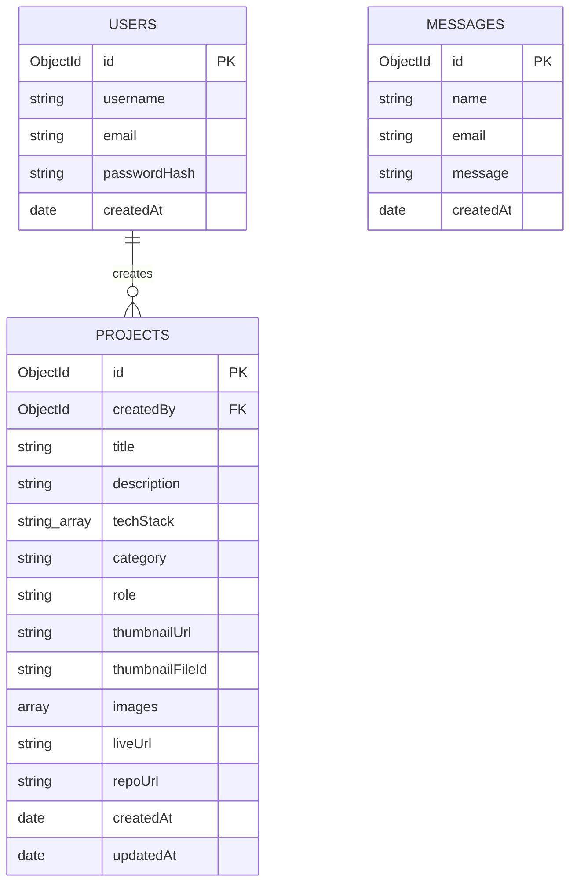

# Product Requirements Document (PRD)
## 1. Overview

### 1.1 Latar Belakang
Website portofolio pribadi untuk menampilkan projek-projek web yang telah dikerjakan, baik secara individu maupun tim, sebagai media untuk memperlihatkan kemampuan teknis kepada recruiter, klien, atau kolaborator potensial.

### 1.2 Tujuan
- Menampilkan projek secara profesional dan terorganisir
- Memudahkan pengelolaan konten projek tanpa perlu edit kode (via admin panel)
- Menunjukkan kemampuan full-stack development melalui produk itu sendiri

### 1.3 Target Pengguna
| Role | Deskripsi |
|---|---|
| Visitor (Public) | Recruiter, klien, sesama developer yang melihat portofolio |
| Admin (Owner) | Pemilik web — mengelola konten projek |

---

## 2. Tech Stack

| Layer | Teknologi |
|---|---|
| Frontend | ReactJS + Vite (ESLint) |
| Backend | Node.js + Express.js |
| Database | MongoDB Atlas (cloud) |
| ORM/ODM | Mongoloquent |
| Design Theme | Claymorphism |
| Auth | JWT (JSON Web Token) |
| Image Storage | ImageKit |
| Frontend Hosting | Vercel |
| Backend Hosting | AWS EC2 + Nginx (reverse proxy) |

---

## 3. Scope

### 3.1 In Scope
- Landing page portofolio (public)
- Halaman detail projek
- Admin panel untuk CRUD data projek (protected route)
- Form kontak
- Responsive design (mobile & desktop)

### 3.2 Out of Scope (v1.0)
- Multi-admin / role management
- Sistem komentar/rating dari visitor
- Blog/artikel

---

## 4. Fitur & Requirement

### 4.1 Public Site

#### 4.1.1 Hero Section
- Nama, role, tagline singkat
- CTA button: "Lihat Projek", "Hubungi Saya"

#### 4.1.2 About Section
- Deskripsi singkat tentang diri & fokus keahlian

#### 4.1.3 Skills Section
- Menampilkan tech stack dikelompokkan (Frontend, Backend, Database, Tools)

#### 4.1.4 Projects Section
- Menampilkan daftar projek dalam bentuk card
- Setiap card menampilkan: thumbnail, judul, deskripsi singkat, tech stack, badge (Solo/Team)
- Filter berdasarkan tag/kategori
- Klik card → menuju halaman detail projek

#### 4.1.5 Project Detail Page
- Deskripsi lengkap projek
- Screenshot/gambar projek
- Tech stack yang digunakan
- Role & kontribusi (jika tim)
- Link live demo & repository

#### 4.1.6 Contact Section
- Form kontak (nama, email, pesan) → dikirim via backend (nodemailer atau simpan ke DB)
- Link sosial media (GitHub, LinkedIn, Email)

### 4.2 Admin Panel (Protected)

#### 4.2.1 Login
- Form login admin (email/username + password)
- Autentikasi via JWT
- Password di-hash menggunakan bcrypt

#### 4.2.2 Dashboard
- List semua projek yang sudah ada
- Tombol tambah, edit, hapus projek

#### 4.2.3 CRUD Projek
- Create: form input judul, deskripsi, tech stack, gambar, link demo, link repo, kategori (solo/team)
- Read: menampilkan list projek di dashboard
- Update: edit data projek yang sudah ada
- Delete: hapus projek (dengan konfirmasi)

---

## 5. Data Model (MongoDB — Draft)

### Collection: `projects`
```json
{
  "_id": "ObjectId",
  "title": "String",
  "description": "String",
  "techStack": ["String"],
  "category": "solo | team",
  "role": "String",
  "thumbnailUrl": "String",
  "thumbnailFileId": "String",
  "images": [
    { "url": "String", "fileId": "String" }
  ],
  "liveUrl": "String",
  "repoUrl": "String",
  "createdAt": "Date",
  "updatedAt": "Date"
}
```

### Collection: `users` (admin)
```json
{
  "_id": "ObjectId",
  "username": "String",
  "email": "String",
  "passwordHash": "String",
  "createdAt": "Date"
}
```

### Collection: `messages` (contact form, opsional)
```json
{
  "_id": "ObjectId",
  "name": "String",
  "email": "String",
  "message": "String",
  "createdAt": "Date"
}
```

---

## 6. API Endpoints (Draft)

| Method | Endpoint | Akses | Deskripsi |
|---|---|---|---|
| GET | /api/projects | Public | Ambil semua projek |
| GET | /api/projects/:id | Public | Ambil detail satu projek |
| POST | /api/contact | Public | Kirim pesan dari form kontak |
| POST | /api/admin/login | Public | Login admin, return JWT |
| POST | /api/admin/projects | Admin | Tambah projek baru |
| PUT | /api/admin/projects/:id | Admin | Edit projek |
| DELETE | /api/admin/projects/:id | Admin | Hapus projek |

---

## 7. Deployment Architecture

```
[Visitor Browser]
      |
      v
[www.namamu.com] --- (DNS custom domain, dikelola via registrar/Route53)
      |
      ├── Frontend → [Vercel] (React + Vite, static build, custom domain attached)
      |
      └── api.namamu.com → [AWS EC2]
                              └── Nginx (reverse proxy, port 80/443, SSL via Certbot)
                                    └── /api → Backend Express (port 3000, internal, dijalankan via PM2)
                                                    |
                                                    v
                                          [MongoDB Atlas] (cloud, akses via Mongoloquent)
                                                    |
                                                    v
                                          [ImageKit] (image storage & delivery/CDN)
```

**Catatan teknis:**
- Domain custom di-split: subdomain utama (misal `www.namamu.com` atau root) diarahkan ke Vercel, subdomain lain (misal `api.namamu.com`) diarahkan ke EC2 — diatur lewat DNS record (A/CNAME) di registrar domain.
- Nginx di EC2 bertugas routing port internal (Express di `localhost:3000`) ke port 80/443 publik, sekaligus handle SSL (Let's Encrypt/Certbot) untuk `api.namamu.com`.
- CORS di Express dikonfigurasi untuk hanya menerima request dari domain frontend (`www.namamu.com`), bukan wildcard.
- Environment variable (Mongo Atlas URI, JWT secret, ImageKit API key) disimpan di `.env` pada EC2 — jangan commit ke repo.
- MongoDB Atlas dipilih agar tidak perlu maintain database sendiri di EC2 (backup, scaling, monitoring sudah ditangani Atlas). Koneksi dari backend menggunakan **Mongoloquent** sebagai ORM (gaya Eloquent-like).
- ImageKit dipakai untuk upload gambar projek dari admin panel; response upload (`url` dan `fileId`) disimpan ke MongoDB. `fileId` dipakai kalau nanti perlu hapus gambar dari ImageKit saat projek dihapus/diedit.
- Rekomendasi: pakai PM2 di EC2 untuk menjaga proses Express tetap hidup (auto-restart kalau crash).

---

## 8. Struktur Folder Project

Menggunakan monorepo dengan 2 folder utama (`client` dan `server`) dalam 1 repository, supaya lebih gampang dikelola sebagai project pribadi meski deployment-nya terpisah (Vercel untuk client, EC2 untuk server).

```
portfolio-project/
├── client/                          # Frontend (React + Vite)
│   ├── public/
│   │   └── favicon.ico
│   ├── src/
│   │   ├── assets/                  # Gambar statis, font, dll
│   │   ├── components/
│   │   │   ├── common/              # Button, Card, Modal, dll (reusable)
│   │   │   ├── layout/              # Navbar, Footer, Container
│   │   │   └── sections/            # Hero, About, Skills, Projects, Contact
│   │   ├── pages/
│   │   │   ├── Home.jsx
│   │   │   ├── ProjectDetail.jsx
│   │   │   └── admin/
│   │   │       ├── Login.jsx
│   │   │       ├── Dashboard.jsx
│   │   │       └── ProjectForm.jsx
│   │   ├── routes/
│   │   │   ├── AppRoutes.jsx
│   │   │   └── ProtectedRoute.jsx   # Wrapper cek token JWT sebelum akses admin
│   │   ├── services/
│   │   │   ├── api.js               # Axios/fetch instance dengan base URL backend
│   │   │   ├── projectService.js
│   │   │   └── authService.js
│   │   ├── context/
│   │   │   └── AuthContext.jsx      # Simpan state login admin
│   │   ├── hooks/
│   │   │   └── useAuth.js
│   │   ├── styles/
│   │   │   ├── globals.css
│   │   │   └── claymorphism.css     # Variabel warna, shadow, radius tema clay
│   │   ├── utils/
│   │   ├── App.jsx
│   │   └── main.jsx
│   ├── .env                         # VITE_API_BASE_URL, VITE_IMAGEKIT_PUBLIC_KEY
│   ├── .eslintrc.cjs
│   ├── vite.config.js
│   └── package.json
│
├── server/                          # Backend (Express)
│   ├── src/
│   │   ├── config/
│   │   │   ├── db.js                # Koneksi MongoDB Atlas (via Mongoloquent)
│   │   │   └── imagekit.js          # Konfigurasi ImageKit
│   │   ├── models/
│   │   │   ├── Project.js           # Model Mongoloquent
│   │   │   ├── User.js
│   │   │   └── Message.js
│   │   ├── controllers/
│   │   │   ├── projectController.js
│   │   │   ├── authController.js
│   │   │   └── messageController.js
│   │   ├── routes/
│   │   │   ├── projectRoutes.js
│   │   │   ├── authRoutes.js
│   │   │   └── messageRoutes.js
│   │   ├── middlewares/
│   │   │   ├── authMiddleware.js    # Verifikasi JWT
│   │   │   ├── rateLimiter.js       # express-rate-limit (login & contact)
│   │   │   └── errorHandler.js
│   │   ├── utils/
│   │   │   └── generateToken.js
│   │   └── app.js                   # Setup Express app, middleware, routes
│   ├── .env                         # MONGO_URI, JWT_SECRET, IMAGEKIT_*, PORT
│   ├── server.js                    # Entry point
│   ├── ecosystem.config.js          # Konfigurasi PM2
│   └── package.json
│
├── .gitignore
└── README.md
```

**Catatan:**
- `client/.env` dan `server/.env` tidak masuk git — pakai `.env.example` sebagai referensi.
- `server/ecosystem.config.js` dipakai PM2 untuk menjalankan & auto-restart proses Express di EC2.
- Folder `routes/` di frontend beda dengan `routes/` di backend — yang satu untuk React Router, satu untuk Express routing. Jangan tertukar saat baca dokumentasi.

---

## 9. Skema Database (ERD)

**Entitas dan relasi:**
- `USERS` (1) → `PROJECTS` (banyak): satu admin bisa membuat banyak projek. Field `createdBy` di `PROJECTS` adalah foreign key ke `USERS`.
- `MESSAGES` berdiri sendiri (tidak berelasi ke entitas lain) — hanya menyimpan pesan masuk dari form kontak.



---

## 10. Non-Functional Requirements
- Responsive di berbagai ukuran layar
- Waktu load halaman < 3 detik
- Admin route tidak bisa diakses tanpa token valid
- Password admin disimpan ter-enkripsi (bcrypt), bukan plaintext
- Rate limiting diterapkan pada:
  - `POST /api/admin/login` — mencegah brute force (misal maks 5 percobaan/15 menit per IP)
  - `POST /api/contact` — mencegah spam (misal maks 3 submit/jam per IP)
  - Implementasi menggunakan middleware seperti `express-rate-limit`

---

## 11. Milestone (Saran)

| Fase | Deliverable |
|---|---|
| 1 | Setup project (Vite, Express, MongoDB connection) |
| 2 | Setup EC2 + Nginx + PM2, deploy skeleton backend |
| 3 | Backend: model, API CRUD projek + auth (JWT) |
| 4 | Integrasi ImageKit untuk upload gambar |
| 5 | Frontend: layout public site (Hero, About, Skills, Projects) |
| 6 | Frontend: halaman detail projek |
| 7 | Admin panel: login + dashboard CRUD |
| 8 | Styling claymorphism (public + admin) |
| 9 | Deploy frontend ke Vercel, hubungkan ke backend EC2 |
| 10 | Testing end-to-end & final polish |

---

## 12. Keputusan yang Sudah Ditetapkan
- **Frontend hosting:** Vercel (dengan custom domain)
- **Backend hosting:** AWS EC2 dengan Nginx sebagai reverse proxy (satu komputer, port di-manage Nginx), custom subdomain (misal `api.namamu.com`)
- **Database:** MongoDB Atlas (cloud), diakses via **Mongoloquent** sebagai ORM
- **Image storage:** ImageKit
- **Dark/light mode:** Tidak diperlukan (single theme claymorphism saja)
- **Rate limiting:** Diperlukan di endpoint login dan contact form

## 13. Open Questions (Sisa)
- Domain custom sudah dibeli/tersedia di registrar mana? (Namecheap, Niagahoster, dll) — perlu untuk setup DNS record
- Mongoloquent belum sepopuler Mongoose (proyek 1 maintainer) — apakah tetap ingin lanjut, atau sedia opsi fallback ke Mongoose kalau nanti terkendala saat development?
